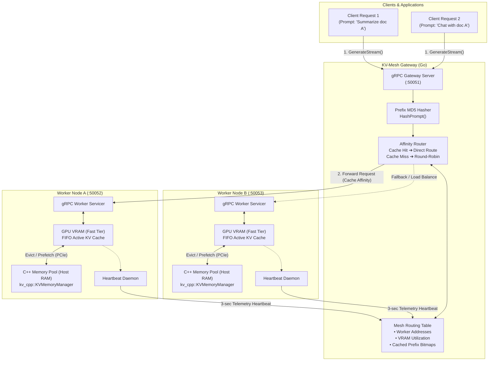
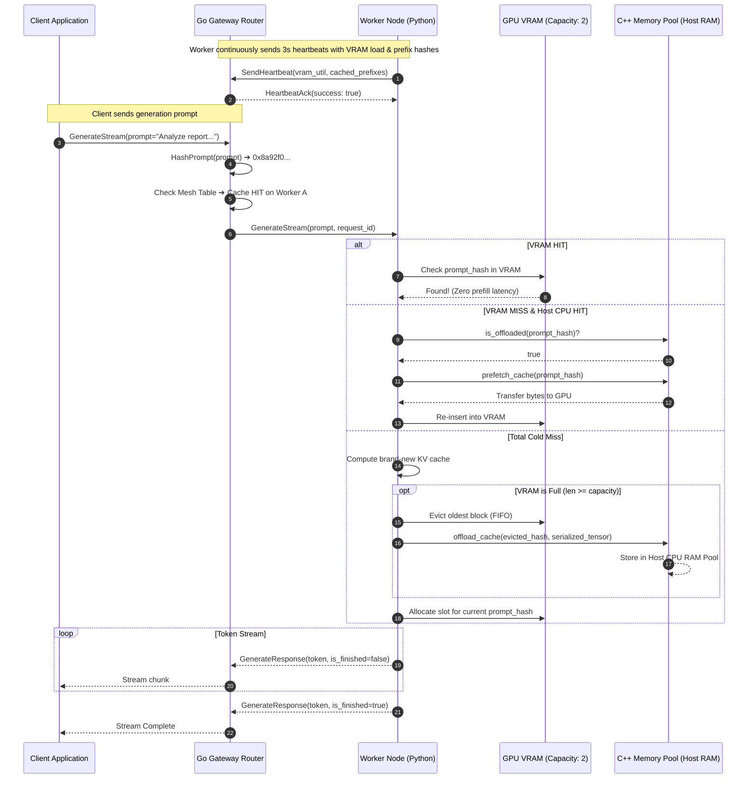

# ⚡ KV-Mesh

<div align="center">

```
  ██ ▄█▀ ██▒   █▓     ███▄ ▄███▓▓█████   ██████  ██░ ██ 
  ██▄█▒ ▓██░   █▒    ▓██▒▀█▀ ██▒▓█   ▀ ▒██    ▒ ▓██░ ██▒
 ▓███▄░  ▓██  █▒░    ▓██    ▓██░▒███   ░ ▓██▄   ▒██▀▀██░
 ▓██ █▄   ▒██ █░░    ▒██    ▒██ ▒▓█  ▄   ▒   ██▒░▓█ ░██ 
 ▒██▒ █▄   ▒▀█░      ▒██▒   ░██▒░▒████▒▒██████▒▒░▓█▒░██▓
 ▒ ▒▒ ▓▒    ░ ░      ░ ▒░   ░  ░░░ ▒░ ░▒ ▒▓▒ ▒ ░ ▒ ░░▒░▒
 ░ ░▒ ▒░    ░ ░      ░  ░      ░ ░ ░  ░░ ░▒  ░ ░ ▒ ░▒░ ░
 ░ ░░ ░       ░      ░      ░      ░   ░  ░  ░   ░  ░░ ░
 ░  ░         ░             ░      ░  ░      ░   ░  ░  ░
```

**A High-Performance Distributed LLM Inference Router with Prefix-Cache-Aware Routing & Heterogeneous Tiered KV-Memory Offloading.**

---

[](https://golang.org)
[](https://python.org)
[](https://isocpp.org)
[](https://grpc.io)
[](https://protobuf.dev)
[](LICENSE)

</div>

---

## 📖 Overview

In modern Large Language Model (LLM) serving architectures, **Time-To-First-Token (TTFT)** and **Compute Overhead** are dominated by redundant **prefill phases** for repeated system prompts, multi-turn chat sessions, and document retrieval (RAG) contexts.

**KV-Mesh** solves this problem by coordinating distributed inference nodes into a cache-aware mesh:
1. **Intelligent Prefix-Cache Routing**: A high-throughput, non-blocking **Go Gateway** analyzes incoming prompts, computes prefix hashes, and dispatches generation requests directly to worker nodes that already host the required Key-Value (KV) cache state in memory.
2. **Heterogeneous Tiered KV Offloader**: When GPU VRAM reaches capacity, a specialized **C++ / pybind11 memory manager** transparently offloads evicted KV blocks from GPU VRAM to Host CPU RAM over PCIe, pre-fetching them back on demand to avoid expensive recalculation.
3. **Real-Time Mesh Telemetry**: Distributed Python workers broadcast live VRAM utilization and prefix bitmaps over low-overhead gRPC heartbeats to keep the gateway's global routing table synchronized with sub-second convergence.

---

## 🏛️ High-Level System Architecture

> 🎨 **Interactive Archify Visualizations**: This project includes verifiable, interactive architecture and sequence diagrams created with **[Archify](https://github.com/tt-a1i/archify)** featuring dark/light themes, pan & zoom, component inspections, and trace animation.
> 
> - 🌐 **[Explore Interactive HLD Architecture Diagram (.html)](.archify/architecture-kvmesh-hld-20261004-201500/kvmesh-architecture.html)** — *Validation: 9/9 checks passed, 0 composition errors*
> - ⚡ **[Explore Interactive Request Sequence Diagram (.html)](.archify/sequence-kvmesh-lifecycle-20261004-201500/kvmesh-sequence.html)** — *Validation: 9/9 checks passed, trace animation enabled*



---

## 🔄 Request Lifecycle & Cache Hit Sequence

The diagram below illustrates the end-to-end flow when a request matches an existing prefix in the mesh, versus when memory pressure triggers the heterogeneous C++ tiered offloader:

> 💡 *View the full interactive version with step-by-step trace animations in **[kvmesh-sequence.html](.archify/sequence-kvmesh-lifecycle-20261004-201500/kvmesh-sequence.html)**.*



---

## 🌟 Key Technical Features

### 1. Prefix-Aware Cache Affinity Routing
Standard round-robin or least-connection routing causes frequent cache churn because identical prefixes land on arbitrary workers. **KV-Mesh** inspects the prompt prefix at the gateway, converts it to a 64-bit fingerprint (`HashPrompt`), and matches it against the cluster's active cache index:
- **Cache Hit**: Request routed directly to the worker with the warm cache, bypassing full prompt token prefill and drastically reducing **TTFT**.
- **Cache Miss**: Request dispatched via load-balancing fallback to distribute generation load.

### 2. Heterogeneous Tiered Memory Subsystem (`C++ / pybind11`)
GPU VRAM is scarce and expensive. KV-Mesh implements a two-tier memory hierarchy:
- **Tier 1 (GPU VRAM)**: Fast execution tier for immediately active sequence blocks.
- **Tier 2 (Host CPU RAM)**: Managed through `kv_cpp::KVMemoryManager`. Evicted KV blocks are offloaded over PCIe into host memory instead of being discarded.
- **Prefetch on Demand**: When a previously offloaded prefix is requested again, the C++ backend pre-fetches the tensor data back into VRAM, converting what would be a costly $O(N)$ transformer recomputation into a lightweight memory transfer.

### 3. Asynchronous Health & Topology Convergence
Workers run a background daemon thread that periodically transmits telemetry:
- Worker ID and reachable gRPC network address.
- Active VRAM utilization ratio.
- Bitmap/list of currently cached prefixes.
- Gateway maintains an auto-expiring worker table (10-second heartbeat TTL) to cleanly evict dead nodes.

---

## 📁 Repository Structure

```
kv-mesh/
├── .archify/                         # Interactive Archify visual diagrams
│   ├── architecture-kvmesh-hld-*/    # System architecture (candidate.json & HTML)
│   └── sequence-kvmesh-lifecycle-*/  # Request lifecycle sequence (candidate.json & HTML)
├── proto/
│   └── kvmesh.proto                  # Protobuf definition (WorkerNode & GatewayNode services)
├── gateway/
│   ├── go.mod                        # Go module definition
│   ├── go.sum                        # Go module checksums
│   ├── main.go                       # Gateway gRPC server & stream proxy
│   ├── pb/                           # Compiled Go Protobuf stubs
│   └── router/
│       └── router.go                 # Cache-aware routing table & hash algorithms
├── worker/
│   ├── cpp_extension/
│   │   └── memory_manager.cpp        # C++ pybind11 Host-RAM pool & PCIe offloader
│   ├── setup.py                      # Build script for C++ native extension
│   ├── main.py                       # Python Worker Node (gRPC servicer + memory manager)
│   ├── client.py                     # CLI test client for streaming inference
│   ├── kvmesh_pb2.py                 # Compiled Python Protobuf classes
│   └── kvmesh_pb2_grpc.py            # Compiled Python gRPC stubs
├── requirements.txt                  # Python dependencies (gRPC, pybind11, vLLM, PyTorch)
├── .gitignore
└── README.md
```

---

## 🚀 Getting Started

### Prerequisites

- **Go**: 1.22+ installed
- **Python**: 3.10+ (tested on Python 3.11 & 3.12)
- **C++ Compiler**: GCC / Clang with C++17 support and python development headers (`python3-dev`)
- **Protocol Buffers Compiler** (`protoc`) with Go and Python plugins

---

### Installation & Build

#### 1. Clone the Repository
```bash
git clone https://github.com/your-username/kv-mesh.git
cd kv-mesh
```

#### 2. Python Environment & C++ Module Compilation
Create a virtual environment and install the required dependencies:
```bash
python -m venv .venv
source .venv/bin/activate       # On Linux / WSL / macOS
# or: .venv\Scripts\activate    # On Windows PowerShell

pip install -r requirements.txt
```

Compile the C++ heterogeneous memory extension:
```bash
cd worker
python setup.py build_ext --inplace
cd ..
```
> *This produces `kv_cpp.*.so` (or `.pyd` on Windows), allowing Python to call the native C++ memory pool.*

---

#### 3. (Optional) Recompiling Protocol Buffers

If you make modifications to [proto/kvmesh.proto](file:///d:/kv-mesh/proto/kvmesh.proto):

**Generate Python Stubs:**
```bash
python -m grpc_tools.protoc -Iproto --python_out=worker --grpc_python_out=worker proto/kvmesh.proto
```

**Generate Go Stubs:**
```bash
protoc --proto_path=proto \
       --go_out=gateway/pb --go_opt=paths=source_relative \
       --go-grpc_out=gateway/pb --go-grpc_opt=paths=source_relative \
       proto/kvmesh.proto
```

---

## 🖥️ Running the Cluster

Open separate terminal windows (or multiplex with `tmux` / WSL):

### Step 1: Start the Go Gateway
```bash
cd gateway
go run main.go
```
*Output:*
```
[Gateway] KV-Mesh Gateway running on port :50051
```

### Step 2: Start Worker Nodes
Spawn two or more worker nodes on different ports. Each worker will register itself with the gateway:

**Terminal A (Worker 1):**
```bash
cd worker
python main.py --port 50052
```

**Terminal B (Worker 2):**
```bash
cd worker
python main.py --port 50053
```

Within 3 seconds, workers will publish their first heartbeat and the Gateway will log the registration:
```
[C++ Backend] Heterogeneous Memory Pool Initialized.
Worker a8b12f4c started on port 50052.
```

---

### Step 3: Run Inference Queries

Send queries to the cluster through the Gateway:

```bash
cd worker

# Query 1: Initial prompt (Cold Miss -> Worker A computes and caches)
python client.py "Explain quantum computing in simple terms"

# Query 2: Repeated prompt (Cache HIT -> Gateway immediately routes to Worker A!)
python client.py "Explain quantum computing in simple terms"

# Query 3: Different prompt (Dispatched to distribute load)
python client.py "Write a fast matrix multiplication kernel"
```

---

## 🔬 Memory Eviction & Tiering in Action

The simulated worker environment models a realistic VRAM constraint (capacity = 2 cache slots). Watch the worker console when issuing queries:

1. **First Request**:
   ```
   [Worker] Total MISS. Computing new KV cache...
   ```
2. **Second Repeated Request**:
   ```
   [Router] KV Cache HIT! Routing hash 178291048291 to worker a8b12f4c
   [Worker] VRAM HIT for hash 178291048291
   ```
3. **VRAM Saturation & PCIe Eviction**:
   ```
   [Worker] VRAM FULL. Evicting hash 49102840192 to CPU.
   [C++ Backend] Offloaded 1048576 bytes for hash 49102840192 to CPU RAM.
   ```
4. **Prefetching from Host RAM on Recall**:
   ```
   [Worker] VRAM MISS but CPU HIT. Pre-fetching over PCIe...
   [C++ Backend] Pre-fetched hash 49102840192 back to GPU.
   ```

---

## 🗺️ Roadmap

- [x] High-performance Go Gateway with dynamic worker registry
- [x] Prefix hashing and cache affinity routing
- [x] Native C++ heterogeneous memory pool (`pybind11`)
- [x] Asynchronous heartbeat & telemetry distribution
- [ ] **Radix Tree Prefix Indexing**: Multi-token hierarchy matching (compatible with SGLang / vLLM RadixAttention)
- [ ] **PagedAttention Integration**: Direct memory block transfer between Host CPU pinned memory and CUDA unified memory
- [ ] **Cross-Worker KV Cache Transfer**: P2P RDMA/NCCL transfer of cache blocks directly between workers across the mesh
- [ ] **OpenAI-Compatible HTTP API**: Reverse proxy endpoint accepting standard `/v1/chat/completions`

---

## 📄 License

This project is licensed under the Apache 2.0 License. See the [LICENSE](LICENSE) file for details.
